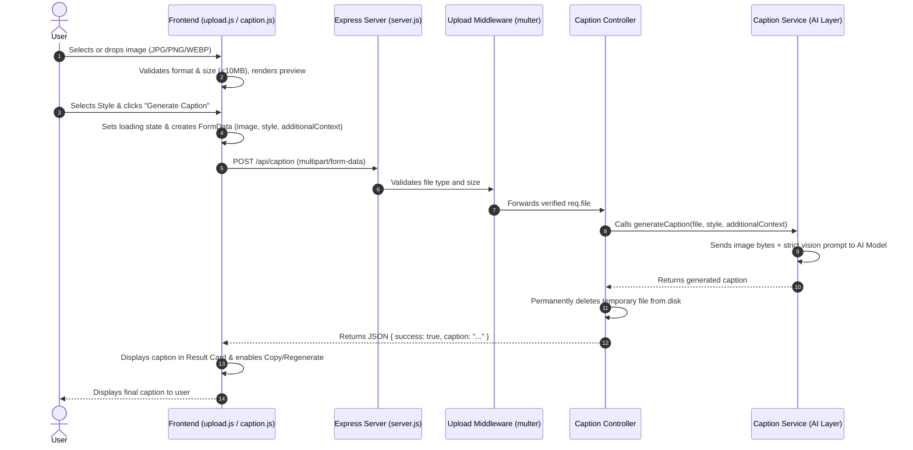

# 🖼️ VisionCaption - AI Image Caption Generator

An original, student-friendly **Image Caption Generator** web application built with a **Vanilla HTML/CSS/JavaScript frontend** and a **Node.js/Express.js backend**.

VisionCaption allows users to upload any photograph or graphic, choose a desired captioning style (Simple, Creative, Professional, Accessibility), optionally supply contextual cues, and receive an authentic caption generated directly from the visual contents of the image.

---

## 📌 Project Overview

VisionCaption bridges **Computer Vision (CV)** and **Natural Language Processing (NLP)**:
- **Vision Encoder**: Inspects image pixels to recognize subjects, physical actions, and environmental context.
- **Language Decoder**: Translates visual observations into natural, grammatically sound sentences based on the requested style.

> **Privacy Guarantee**: Uploaded images are processed solely in temporary memory/cache and are permanently removed from the server immediately after caption generation.

---

## ✨ Features

- **Original Clean UI**: Designed with a focused, student-friendly layout (Navigation, Upload card, Preview, and Result card).
- **Drag-and-Drop File Upload**: Interactive dropzone supporting **JPG, JPEG, PNG, and WEBP** (up to 10MB).
- **Live Preview & Metadata**: Real-time image preview, original filename, formatted file size, and a one-click **Remove** button.
- **Caption Style Customization**:
  - `Simple`: Direct, clear one-sentence summary.
  - `Creative`: Engaging, descriptive storytelling tone.
  - `Professional`: Formal, publication-grade text.
  - `Accessibility`: Objective, detailed Alt-Text description for screen readers.
- **Optional Context Field**: Allows the user to provide optional background notes to assist the AI model.
- **Strict Visual Analysis**: Prompted strictly to describe visible entities and actions—never guessing based on filenames or metadata.
- **Result Actions**:
  - **Copy Caption**: One-click clipboard copy with instant toast confirmation.
  - **Generate Again**: Re-runs caption generation on the currently loaded image without re-uploading.
- **Isolated AI Layer**: `backend/services/captionService.js` easily adapts between **Google Gemini Vision**, **Hugging Face BLIP**, **OpenAI GPT-4o Vision**, or custom Python servers.

---

## 📂 Project Structure

```text
image-caption-generator/
│
├── frontend/                       # Client-Side Application
│   ├── index.html                  # Landing / Home Page
│   ├── generate.html               # Main Caption Generator Tool
│   ├── about.html                  # Educational & Technical Overview Page
│   │
│   ├── css/
│   │   ├── style.css               # Global Theme, Layout & Component Styles
│   │   └── responsive.css          # Mobile & Tablet Breakpoints
│   │
│   ├── js/
│   │   ├── main.js                 # Navigation & Global Utilities
│   │   ├── upload.js               # File Upload, Validation & Preview Logic
│   │   └── caption.js              # API Integration, State Management & Copy Actions
│   │
│   └── assets/
│       └── images/                 # Static Assets
│
├── backend/                        # Server-Side Application
│   ├── server.js                   # Express Application Entry Point
│   │
│   ├── routes/
│   │   └── captionRoutes.js        # API Route Definitions (/api/caption)
│   │
│   ├── controllers/
│   │   └── captionController.js    # Request Coordination & Disk Cleanup
│   │
│   ├── services/
│   │   └── captionService.js       # Dedicated Vision AI / Model Service
│   │
│   ├── middleware/
│   │   └── uploadMiddleware.js     # Multer File Filtering & Size Enforcement
│   │
│   └── config/
│       └── config.js               # Centralized Environment Configuration
│
├── .env.example                    # Environment Variable Template
├── .env                            # Active Local Configuration
├── .gitignore                      # Git Ignore Rules
├── package.json                    # Project Metadata & Dependencies
└── README.md                       # Comprehensive Project Documentation
```

---

## 🛠️ Tech Stack

### Frontend
- **HTML5**: Semantic document structure across `index.html`, `generate.html`, and `about.html`.
- **CSS3**: Modern Flexbox/Grid, custom variables, responsive design, and smooth transitions.
- **Vanilla JavaScript (ES6+)**: Modular file separation (`upload.js`, `caption.js`, `main.js`), Fetch API, and DOM manipulation.

### Backend
- **Node.js**: Asynchronous JavaScript runtime environment.
- **Express.js**: REST API routing and static file serving.
- **Multer**: Multipart/form-data middleware for file validation.
- **Dotenv**: Environment variable security.
- **CORS**: Cross-origin resource sharing support.

---

## 🔄 How the Application Works



---

## 🚀 Quickstart & Setup

### 1. Prerequisites
- [Node.js](https://nodejs.org/) (version 16.x or higher)
- npm (version 8.x or higher)

### 2. Install Dependencies
```bash
npm install
```

### 3. Configure Environment Variables
Copy `.env.example` to `.env`:
```bash
cp .env.example .env
```

Open `.env` and add your preferred AI Vision API key:
```env
AI_PROVIDER=gemini
GEMINI_API_KEY=your_gemini_api_key_here
```

> **Tip**: You can get a free Google Gemini API key at [Google AI Studio](https://aistudio.google.com).

### 4. Start the Application
```bash
npm start
```
*(Or `npm run dev` for automatic reloading)*

Open your browser and navigate to:
```
http://localhost:5000
```

---

## 🔌 AI Model Configuration Options

All model interactions are isolated inside **[`backend/services/captionService.js`](file:///c:/Users/lalit/Documents/image_caption_generator/backend/services/captionService.js)**. Configure your choice in `.env`:

### 1. Google Gemini 1.5 Flash Vision (Recommended)
```env
AI_PROVIDER=gemini
GEMINI_API_KEY=AIzaSy...
GEMINI_MODEL=gemini-1.5-flash
```

### 2. Hugging Face Inference API (BLIP)
```env
AI_PROVIDER=huggingface
HUGGINGFACE_API_KEY=hf_...
HUGGINGFACE_MODEL_URL=https://api-inference.huggingface.co/models/Salesforce/blip-image-captioning-large
```

### 3. OpenAI GPT-4o Vision
```env
AI_PROVIDER=openai
OPENAI_API_KEY=sk-...
OPENAI_MODEL=gpt-4o-mini
```

### 4. Custom Python Backend (FastAPI / Flask)
```env
AI_PROVIDER=custom_api
CUSTOM_MODEL_ENDPOINT=http://localhost:8000/predict
```

---

## 📡 API Documentation

### `POST /api/caption`
Receives an image and returns the AI-generated caption.

- **Content-Type**: `multipart/form-data`
- **Fields**:
  - `image`: File (JPG, JPEG, PNG, WEBP, Max 10MB) - **Required**
  - `style`: String (`Simple`, `Creative`, `Professional`, `Accessibility`) - *Optional (Default: `Simple`)*
  - `additionalContext`: String (User guidance notes) - *Optional*

#### Success Response (`200 OK`):
```json
{
  "success": true,
  "caption": "Three children are exploring plants together in a garden.",
  "metadata": {
    "filename": "children_garden.jpg",
    "sizeBytes": 204850,
    "mimeType": "image/jpeg",
    "style": "Simple"
  }
}
```

#### Error Response (`400 Bad Request` or `500 Server Error`):
```json
{
  "success": false,
  "message": "Unsupported format. Please upload a JPG, JPEG, PNG, or WEBP image."
}
```

---

### `GET /api/health`
Health-check endpoint.

- **Response (`200 OK`)**:
```json
{
  "status": "online",
  "app": "VisionCaption",
  "provider": "gemini",
  "timestamp": "2026-08-31T08:30:00.000Z"
}
```

---

## 📄 License
This project is open-source under the [ISC License](LICENSE) for educational and internship demonstration purposes.
